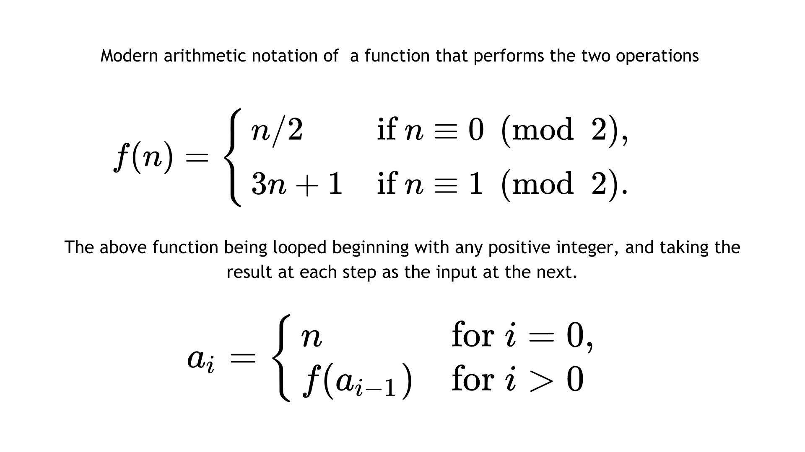
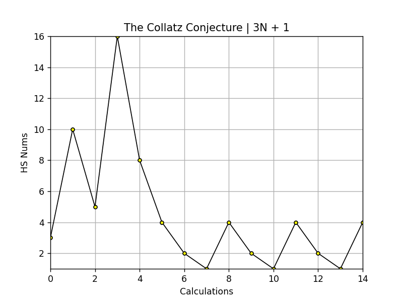
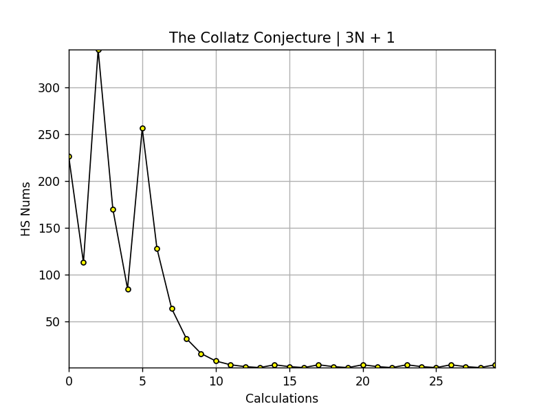
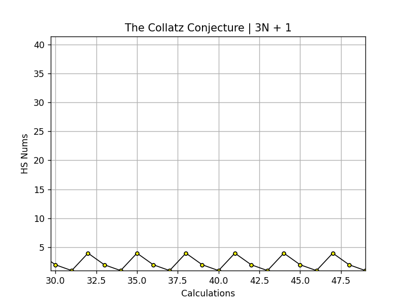
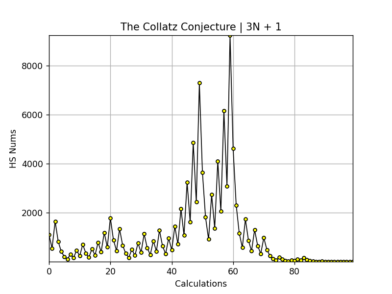

# The Collatz Conjecture (3N+1)
In modular arithmetic notation, define the function f as follows:
## [Table of Contents](#table-of-contents)

- [Table of Contents](#table-of-contents)
- [About](#about)
  - [Origins and Name](#origins-name)
  - [Rules](#rules)
  - [Complex Behavior](#complex-behavior)
  - [Efforts To Solve](#efforts-to-solve)

## [About](#about)

### [Origins and Name](#origins-name) 
The **Collatz Conjecture**, also known as the **3n+1 conjecture** or the **hailstone sequence**, is a mathematical conjecture that concerns a sequence of numbers generated by a specific rule. The conjecture asks whether repeating two easy arithmetic operations on a sequence of numbers will eventually transform every positive integer into 1. It concerns sequences of integers in which each term is obtained from the previous term as follows: if the previous term is even, the next term is one half of the previous term. If the previous term is odd, the next term is 3 times the previous term plus 1. I described this in more detail in the [Rules](#rules) section. The conjecture is that these sequences always reach 1, no matter which positive integer is chosen to start the sequence.

The conjecture is named after the German mathematician [Lothar Collatz](https://en.wikipedia.org/wiki/Lothar_Collatz), who first proposed it in 1937. The conjecture is sometimes called the "3n+1 conjecture" because of the rule that involves multiplying by 3 and adding 1, and it's sometimes referred to as the "hailstone sequence" because the values in the sequence go up and down like hailstones in a storm.

 The Collatz Conjecture has fascinated mathematicians and researchers for decades due to its accessibility, potential connections to other mathematical concepts, and the challenge it presents in terms of proving its validity.

 It concerns sequences of integers in which each term is obtained from the previous term as follows:

## [Rules](#rules)
Here's a breakdown of the two rules for the Collatz Conjecture and how it works in general:

- Start with any positive integer *`n`*
- If *`n`* is even, divide it by **2** to get *`n/2`*
- If *`n`* is odd, multiply it by 3 and add 1 to get *`3n + 1`*
- Repeat the process with the result obtained in step 2 or step 3, and continue applying the same rules to each subsequent number in the sequence.

> As mentioned previously the conjecture states that, regardless of the initial value of
*`n`*, this sequence will eventually reach the number 1. Once the sequence reaches 1, it will continue in a loop: 1 → 4 → 2 → 1
 
Below is an example of these rules in modern arithmetic notation to better visualize it

## [Complex Behavior](#complex-behavior)

Despite its simple rules, the behavior of the Collatz sequence becomes quite complex as numbers get larger. Some numbers exhibit long, erratic sequences before eventually converging to 1. This complexity has made it difficult to prove the conjecture true for all positive integers. Smaller starting numbers have a shorter sequence of steps before reaching 1, so I'll demonstrate with small number first. 

For example, let's make the first starting number 6, so `n = 6`:

1) ***6*** is even, `6/2 = 3`
2) ***3*** is odd, `3*3 + 1 = 10`
3) ***10*** is even, `10/2 = 5`
4) ***5*** is odd, `5*3 + 1 = 16`
5) ***16*** is even, `16/2 = 8`
6) ***8*** is even, `8/2 = 4`
7) ***4*** is even, `4/2 = 2`
8) ***2*** is even, `2/2 = 1`
9) ***1*** is odd, `1*3 + 1 = 4`
10) ***4*** is even, `4/2 = 2`
11) ***2*** is even, `2/2 = 1`
12) ***1*** is odd, `1*3 + 1 = 4`
13) ***4*** is even, `4/2 = 2`
14) ***2*** is even, `2/2 = 1`

This is what it looks like plotted on a graph:

 

As you can see, once the sequence reaches **1** it begins looping 1 - 4 - 2 - 1 endlessly.
Mathematically you can easily understand and see exactly why this happens given the
two "*rules*" or calculations being applied to even and odd numbers. Although while the 
conjecture is relatively easy to understand and has been tested extensively for many 
values of `n` using computers and otherwise, a formal proof of the conjecture's validity 
or counterexample (*a number that doesn't follow the sequence to 1*) has eluded 
mathematicians for decades. The Collatz Conjecture remains one of the most famous 
unsolved problems in number theory. Despite its simplicity, its behavior becomes 
incredibly complex as the numbers involved increase, making it a fascinating and really cool area of study in mathematics. 

To demonstrate the increasing compexity I'll use a slightly larger number like **75** as the seed. 

As you can see no matter the number we end up in the same loop at the end again, 1 - 4 - 2 - 1 - 4 - 2 - 1 ... The low and high points are random yet you will always get that downward trend to the loop. The following image is a zoomed in section of the above graph where the looping starts:

The equation `1*3 + 1` will always be `4` which is even, so `4/2` then `2/2` will always end up back at 1 again, and so on.

If you use an even larger number to begin with such as **2,196** the results may be surprising. The sequence begins in the same usual downward trend before spiking way up beyond the original seed. Yet keeping true to the weirdness of mathematics, even after this drastic increase in the size of the number it always resolves itself back down to 1 begining the loop again. 

## [Efforts to Solve](#efforts-to-solve)

From its conception in 1937 to today, the Collatz Conjecture remains an unsolved problem in mathematics. No one has been able to prove or disprove the conjecture for all positive integers. Many mathematicians have attempted to tackle the problem, but the complexity and intricacy of the sequences have made it challenging to devise a proof or counterexample.
The Collatz Conjecture has been verified for an extremely large number of starting values using dedicated computers with simulations that have verified the conjecture for countless initial values, including those that are well beyond the reach of manual calculations. However, the sheer number of possibilities to check makes it impractical to definitively prove the conjecture true through exhaustive testing.

So, is there a number that can disprove the conjecture? and if so how do we find it? In my personal opinion I think it's reasonable at this point to say the results will be the same no matter the number, but as the famous mathematician [Paul Erdős](https://en.wikipedia.org/wiki/Paul_Erd%C5%91s) said "*Mathematics is not yet ripe enough for such questions*"

Over the years people in various feilds such as number theorists, graph theorists, dynamic systems analysts, scientists, puzzle solvers, educators and mathematicians have developed various techniques and strategies in attempts to prove or disprove the conjecture. Some approaches involve finding specific properties of the sequence or exploring the behavior of particular subsets of integers and yet, still no one has been able to crack this puzzle. 

Because the Collatz Conjeture serves as an example of a simple problem with surprisingly complex behavior, it's often used as a pedagogical tool to introduce concepts of iteration, recursion, and mathematical reasoning. 

